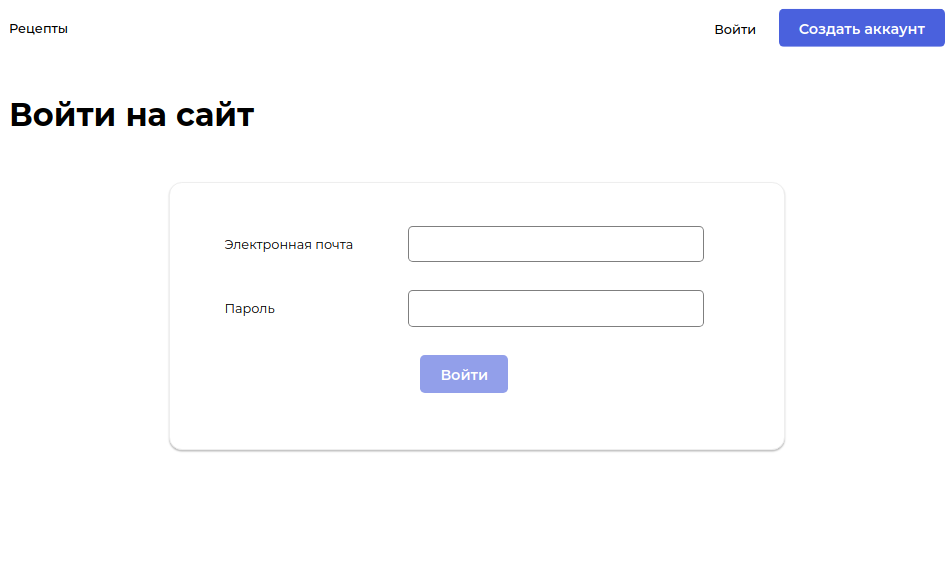
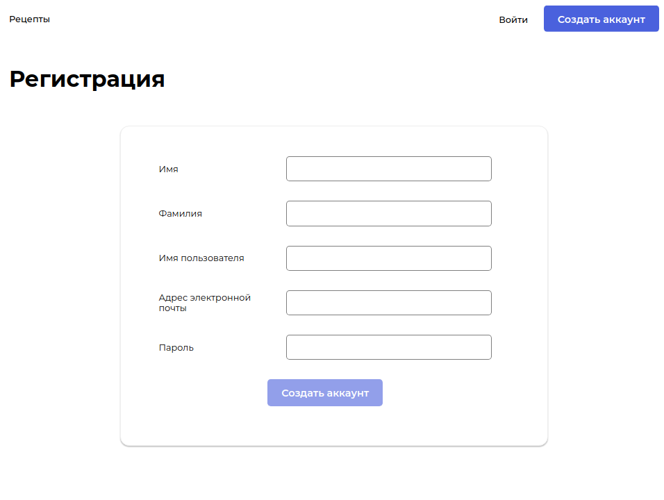
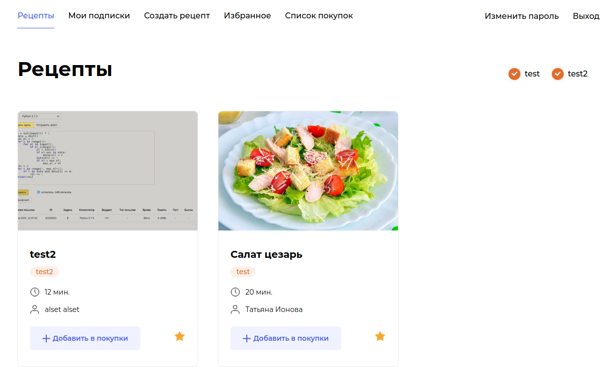
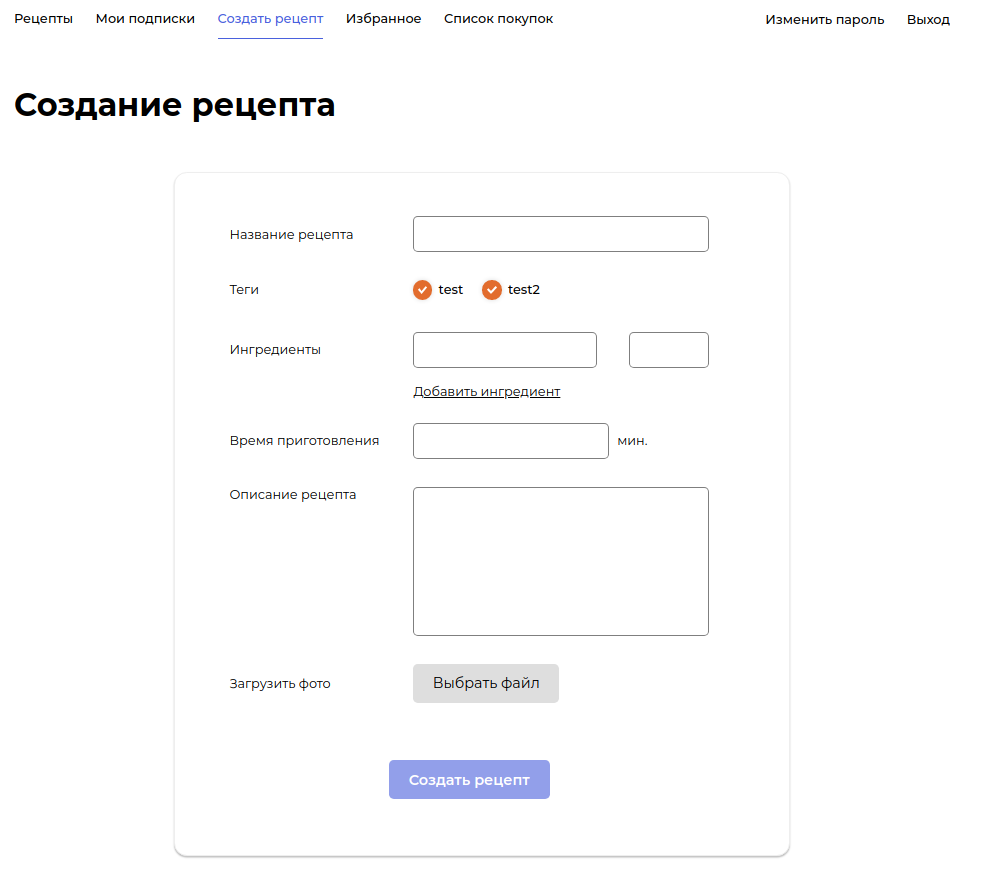
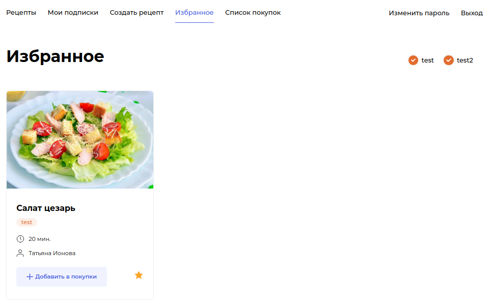
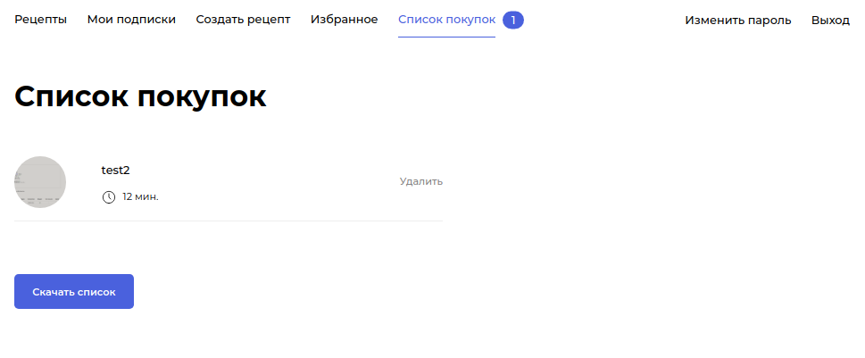

<h1 align="center">Дипломный проект курса от Яндекс Практикума <a href='https://practicum.yandex.ru/backend-developer'>Python-разработчик</a></h1>

<h1 align="center">Привет </a> 
</h1>
<h3 align="center">Foodgram, «Продуктовый помощник» </h3>

    На этом сервисе пользователи смогут публиковать рецепты, подписываться на публикации других пользователей, добавлять понравившиеся рецепты в список «Избранное», а перед походом в магазин скачивать сводный список продуктов, необходимых для приготовления одного или нескольких выбранных блюд.

<h3>Иллюстрация приложения в картинках </h3>

  
Войти на сайт

  

  
Регистрация

  

  
Рецепты

  

  
Создание рецепта

  

  
Избранное

  

  
Список покупок

  

<h3 align="center">Запуск проекта </h3>

  В папке ./infra нужно создать файл .env
    
    Пример содержания:    

    DB_ENGINE=django.db.backends.postgresql 
    DB_NAME=postgres 
    POSTGRES_USER=postgres
    POSTGRES_PASSWORD=postgres
    DB_HOST=db
    DB_PORT=5432 

    DJANGO_SUPERUSER_EMAIL=z@mail.ru
    DJANGO_SUPERUSER_USERNAME=z
    DJANGO_SUPERUSER_PASSWORD=z
    DJANGO_FIRST_NAME_SUPERUSER=z
    DJANGO_SECOND_NAME_SUPERUSER=z
    DJANGO_LAST_NAME_SUPERUSER=z

    В ./infra выполните команду docker-compose up.
    Проект запустится на адресе http://localhost, увидеть спецификацию API вы сможете по адресу http://localhost/api/docs/

<h3>Технические требования и инфраструктура </h3>

    Проект должен использовать базу данных PostgreSQL.
    Код должен находиться в репозитории foodgram-project-react.
    В Django-проекте должен быть файл requirements.txt со всеми зависимостями.
    Проект нужно запустить в трёх контейнерах (nginx, PostgreSQL и Django) (контейнер frontend используется лишь для подготовки файлов) через docker-compose на вашем сервере в Яндекс.Облаке. Образ с проектом должен быть запушен на Docker Hub.

<h3 align="center">Деплой на момент защиты диплома </h3>

Сервер: http://62.84.115.61/
Admin: admin@mail.ru / admin

Адинка Django: http://62.84.115.61/api/admin/
pgadmin: http://62.84.115.61:5555 (z@amail.ru/z)

#### Технологии которые я ипользовал на курсе:
    Python
    Django
    GitHub
    SQL
    PostgreSQL
    Bash
    Nginx
    Gunicorn
    Docker
    Docker Hub

#### Итог обучения:
    1. Новый скилы Django + Django-drf
    2. Закрепил старые навыки